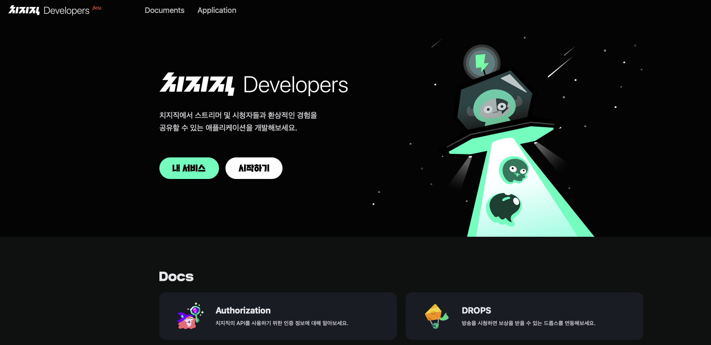
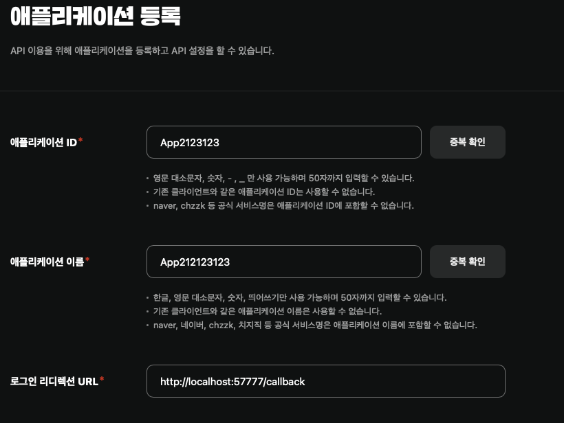
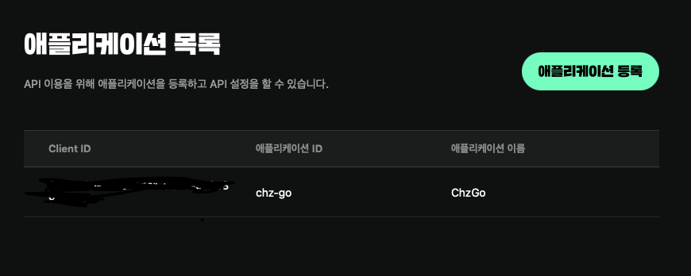

# chzzk-go

chzzk-go is a Go client library for accessing [Chzzk](https://chzzk.naver.com). This library provides APIs via official ways only.  

Korean Documentation is available:
- [한국어 문서](docs/README.kr.md)

## Installation

`go get github.com/sdkim96/chzzk-go`

will resolve and add external dependencies.

## Usage

```go

import chzzk "github.com/sdkim96/chzzk-go"

func main() {
    ctx, cancel := context.WithTimeout(context.Background(), 300*time.Second)
    defer cancel()

    c := chzzk.New(nil).WithAPIKey("your-chzzk-api-key-here")
    user, err := c.User.Me(ctx)
    if err != nil {
        panic(err)
    }
    fmt.Println("ChannelID: ", user.ChannelID)
    fmt.Println("ChannelName: ", user.ChannelName)
}
```

To use this example, you should register your application to Chzzk.

### How to Make Application

First of all, You must register your application to Chzzk server.
Open the browser, access to https://developers.chzzk.naver.com



You can register your application like this.



> Note: You MUST fill the redirection URL field out `http://localhost:57777/callback`.

Finds out why you have to hard-code as `:57777`: https://github.com/sdkim96/chzzk-go/blob/main/internal/login/login.go#L9-L17

If you have registered, your application will be recorded as:



Well done! 

### How to Login

You can find the guide [here](https://github.com/sdkim96/chzzk-go/tree/main/cmd/chzzk-login/README.md).

## Authentication

There are two ways to authenticate:

### Client Credentials

Use `WithClientAuth` for server-to-server API calls (e.g., session auth, token management).

```go
c := chzzk.New(nil).WithClientAuth("your-client-id", "your-client-secret")
```

### API Key (User Access Token)

Use `WithAPIKey` for user-scoped API calls (e.g., user info, chat subscription).

```go
c := chzzk.New(nil).WithAPIKey("your-access-token")
```

## Services

### Token

```go
c := chzzk.New(nil).WithClientAuth(clientID, clientSecret)

// Issue a new token
token, err := c.Token.NewToken(ctx, chzzk.TokenNewRequest{
    TokenRequest: chzzk.TokenRequest{
        GrantType:    chzzk.GrantTypeAuthorizationCode,
        ClientID:     clientID,
        ClientSecret: clientSecret,
    },
    Code:  code,
    State: state,
})

// Refresh a token
token, err := c.Token.RefreshToken(ctx, chzzk.TokenRefreshRequest{
    TokenRequest: chzzk.TokenRequest{
        GrantType:    chzzk.GrantTypeRefreshToken,
        ClientID:     clientID,
        ClientSecret: clientSecret,
    },
    RefreshToken: "your-refresh-token",
})

// Revoke a token
err := c.Token.RevokeToken(ctx, chzzk.RevokeTokenRequest{
    ClientID:      clientID,
    ClientSecret:  clientSecret,
    Token:         "token-to-revoke",
    TokenTypeHint: "access_token",
})
```

### User

```go
c := chzzk.New(nil).WithAPIKey("your-access-token")

user, err := c.User.Me(ctx)
fmt.Println(user.ChannelID, user.ChannelName)
```

### Session (Real-time Events)

```go
c := chzzk.New(nil).WithClientAuth(clientID, clientSecret)

// Get a session URL
sessionURL, err := c.Session.AuthClient(ctx)

// Subscribe/unsubscribe to chat events
err := c.Session.SubscribeChat(ctx, sessionKey)
err := c.Session.UnSubscribeChat(ctx, sessionKey)
```

### Socket.IO

The `socketio` package provides a Socket.IO v2 client for receiving real-time events.

```go
import "github.com/sdkim96/chzzk-go/socketio"

conn := socketio.New(wsURL,
    socketio.WithHandler("CHAT", func(data []byte) error {
        fmt.Println("Chat:", string(data))
        return nil
    }),
    socketio.WithHandler("DONATION", func(data []byte) error {
        fmt.Println("Donation:", string(data))
        return nil
    }),
)

err := conn.Dial(ctx)
defer conn.Close(ctx, 1000, "done")

err = conn.Loop(ctx) // blocks until context is cancelled or error
```

## Testing

```bash
# Unit tests
go test ./...

# Integration tests (requires CHZZK_CLIENT_ID and CHZZK_CLIENT_SECRET)
go test -tags=integration ./...
```

## License

MIT

